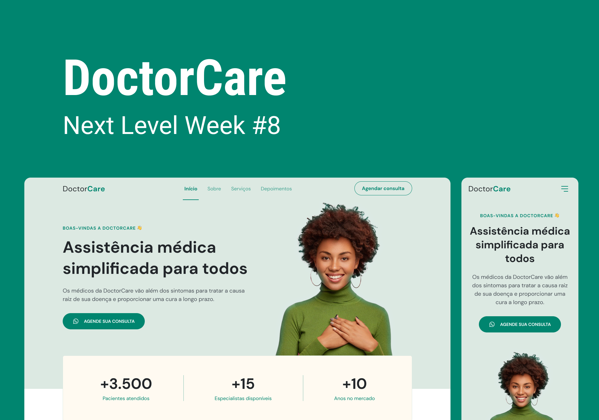

Check my work on <a href="https://eduhrodrigues.github.io/Doctor-Care/"> github.io/Doctor-Care

  
 

# Desafio Rocketseat NLW Return - Trilha Origin
## Projeto: Pretty PetShop
Meu projeto é um modelo mobile first de site adaptável para diversos nichos de mercado.
Simulando uma página de pet shop, o Pretty PetShop conta com soluções diferenciadas.

O Catálogo Online consiste numa Google Planilha pública (somente leitura para o usuário), onde fica o catálogo de produtos; online e facilmente editável, com a foto, a descrição e um link, que leva até o canal de vendas no Whastapp, onde um bot reconhece o produto, adiciona num novo pedido e segue o atendimento.

Produtos em Destaque é um card extra adicionado, incorporando o Catálogo Online.
Os 8 produtos mais a cima da planilha serão exibidos neste card com scrolling.

O Bot PetShop é um bot de atendimento web que, faz o primeiro atendimento, tira dúvidas, e direciona o usuário para o Catálogo Online completo ou diretamente para o Whastapp bot.

O Pretty PetShop conta ainda com 4 temas extras de cores diferentes para diversos gostos!

Veja como ficou aqui: <a href="https://eduhrodrigues.github.io/Doctor-Care/"> github.io/Doctor-Care